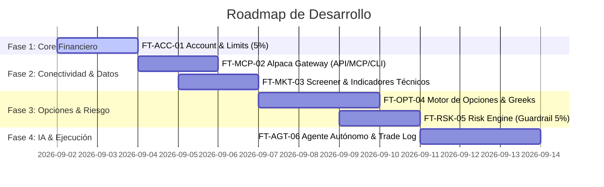

# 📋 Épicas, Features y User Stories del Proyecto
## Hackathon: Alpaca AI Trading Agents (Opciones + MCP + Agentes Autónomos)

Este documento contiene el desglose funcional de Épicas, Features y User Stories para la construcción del sistema de trading autónomo con opciones basado en los diagramas de arquitectura y modelos cuantitativos aprobados.

---

```
                       ┌─────────────────────────────────────────────────────────┐
                       │                   ESTRUCTURA GENERAL                    │
                       └─────────────────────────────────────────────────────────┘
                                                    │
        ┌───────────────────┬───────────────────────┼───────────────────────┬───────────────────┐
        ▼                   ▼                       ▼                       ▼                   ▼
┌──────────────┐    ┌──────────────┐        ┌──────────────┐        ┌──────────────┐    ┌──────────────┐
│   ÉPICA 1    │    │   ÉPICA 2    │        │   ÉPICA 3    │        │   ÉPICA 4    │    │   ÉPICA 5    │
│  Account &   │    │  Alpaca MCP  │        │ Market Data  │        │   Options    │    │ Risk Engine  │
│ Limits (5%)  │    │  & Gateway   │        │  & Screener  │        │  & Analytics │    │  & Execution │
└──────────────┘    └──────────────┘        └──────────────┘        └──────────────┘    └──────────────┘
```

---

## 🏛️ Matriz General de Épicas y Features

| ID Épica | Nombre de la Épica | Feature Principal | Prioridad | Módulos de Código (`src/`) |
| :--- | :--- | :--- | :--- | :--- |
| **EPIC-01** | **Gestión de Cuenta y Límites Financieros** | **FT-ACC-01: Account & Limits Engine** *(Feature Inicial)* | **Crítica (P0)** | `src/account.py` |
| **EPIC-02** | **Conectividad e Infraestructura MCP/CLI** | **FT-MCP-02: Alpaca MCP & Tool Gateway** | **Alta (P1)** | `src/execution/mcp_client.py` |
| **EPIC-03** | **Universo de Inversión y Datos de Mercado** | **FT-MKT-03: Screener & Technical Indicators** | **Alta (P1)** | `src/config.py`, `src/indicators/technicals.py` |
| **EPIC-04** | **Motor de Opciones y Análisis Cuantitativo** | **FT-OPT-04: Options Chain & Greeks Engine** | **Alta (P1)** | `src/options/chain_filter.py`, `src/options/greeks.py` |
| **EPIC-05** | **Motor de Riesgo y Salvaguardas Pre-Trade** | **FT-RSK-05: Risk Engine & Validation** | **Crítica (P0)** | `src/risk/risk_engine.py` |
| **EPIC-06** | **Agente Autónomo y Bitácora de Operaciones** | **FT-AGT-06: Autonomous Strategy & Trade Logger** | **Media (P2)** | `src/agents/strategy_agent.py`, `src/execution/trade_logger.py`, `src/main.py` |

---

# 🚀 Detalle de Épicas, Features y User Stories

---

## 🌟 ÉPICA 1: Gestión de Cuenta y Límites Financieros (Account & Financial Guardrails)
> **Objetivo:** Obtener el estado financiero de la cuenta de Alpaca Paper Trading en tiempo real y calcular de forma determinista el set de límites de capital (regla del 5% max risk) para proteger la cuenta antes de cualquier cálculo de estrategia.

### Feature 1 (Principal): `FT-ACC-01` — Account Management & Limit Engine

#### 📖 User Story `US-01.1`: Snapshot Detallado del Estado de Cuenta
* **Como:** Agente autónomo de trading.
* **Quiero:** Consultar el balance, liquidez y estado de la cuenta en Alpaca en tiempo real (`cash`, `portfolio_value`, `buying_power`, `equity`, `margin`, `daytrading_buying_power`, etc.).
* **Para:** Conocer exactamente con qué capital cuento antes de evaluar cualquier operación.
* **Criterios de Aceptación:**
  - [x] Debe conectarse a Alpaca Paper Trading usando `TradingClient`.
  - [x] Debe extraer y tipar correctamente todos los valores numéricos usando `Decimal` para evitar errores de precisión flotante.
  - [x] Debe reportar el estado de bloqueo o advertencia de la cuenta (`is_frozen`, `is_active`, `daytrading_count`, `is_daytrader`).
  - [x] Si la API de Alpaca no responde o falla la autenticación, debe lanzar una excepción controlada con mensaje descriptivo.

#### 📖 User Story `US-01.2`: Motor de Cálculo del Límite de Riesgo del 5%
* **Como:** Risk Manager del sistema.
* **Quiero:** Calcular el límite máximo de pérdida o asignación por operación fija al 5% del valor de la cartera (`portfolio_value`) o del `buying_power`.
* **Para:** Garantizar que ninguna operación de opciones individual pueda comprometer la solvencia de la cuenta.
* **Criterios de Aceptación:**
  - [x] Debe existir una función `calculate_trade_limits(account_snapshot, max_risk_pct=0.05)` que retorne el valor máximo en dólares permitidos para un trade.
  - [x] Debe calcular también el límite total de exposición acumulada máxima (ej. máximo 25% de la cuenta en opciones simultáneas).
  - [x] Debe rechazar inmediatamente operaciones si el `buying_power` disponible es inferior al límite calculado o al costo del contrato de opciones.

#### 📖 User Story `US-01.3`: Guardrail de Salud y Estado de Cuenta
* **Como:** Orquestador del sistema de trading.
* **Quiero:** Verificar que la cuenta esté activa, no congelada y sin violaciones de margen antes de autorizar cualquier ciclo de trading.
* **Para:** Prevenir llamadas a la API o aperturas de órdenes inválidas que puedan generar penalizaciones en la cuenta.
* **Criterios de Aceptación:**
  - [x] Si `is_frozen == True` o `is_active == False`, el sistema debe abortar el ciclo y generar una alerta crítica en el log.
  - [x] Si `maintenance_margin >= equity`, emitir alerta de riesgo de liquidación.

---

## 🌟 ÉPICA 2: Conectividad e Infraestructura MCP/CLI (Alpaca Gateway)
> **Objetivo:** Implementar la capa de comunicación cliente que interactúa con el contenedor de **Alpaca MCP Server** y las herramientas CLI para consulta de mercado y ejecución.

### Feature 2: `FT-MCP-02` — Alpaca MCP & Tool Gateway

#### 📖 User Story `US-02.1`: Conexión de Herramientas MCP para el Agente
* **Como:** Agente con LLM.
* **Quiero:** Disponer de interfaces de herramientas (Tools/MCP) para solicitar cotizaciones, chains de opciones y consultar el estado de las órdenes.
* **Para:** Interactuar de forma modular con el servidor MCP de Alpaca según los estándares del protocolo MCP.
* **Criterios de Aceptación:**
  - [x] Definir el cliente/wrapper de comunicación con el contenedor MCP de Alpaca.
  - [x] Mapear los métodos de consulta de cuenta, datos de mercado y colocación de órdenes a interfaces de herramientas estándar.
  - [x] Implementar timeouts y reintentos con backoff exponencial en caso de desconexión momentánea.

#### 📖 User Story `US-02.2`: Integración de Comandos CLI como Fallback / Herramienta de Diagnóstico
* **Como:** Desarrollador / Agente en DevContainer.
* **Quiero:** Poder invocar el binario `alpaca` CLI preinstalado para diagnósticos rápidos de cuenta y mercado.
* **Para:** Validar la conectividad del entorno de desarrollo y realizar auditorías independientes.
* **Criterios de Aceptación:**
  - [x] El binario `/usr/bin/alpaca` debe responder correctamente a comandos como `alpaca account` y `alpaca market`.

---

## 🌟 ÉPICA 3: Universo de Inversión y Datos de Mercado (Market Data & Screener)
> **Objetivo:** Filtrar los activos más líquidos del mercado estadounidense y computar indicadores técnicos para detectar condiciones óptimas de entrada.

### Feature 3: `FT-MKT-03` — Screener & Technical Indicators Engine

#### 📖 User Story `US-03.1`: Filtro de Universo de Inversión Líquido
* **Como:** Analista cuantitativo.
* **Quiero:** Monitorear el universo inicial compuesto por `AAPL`, `MSFT`, `SPY`, `QQQ` y `NVDA` aplicando filtros de liquidez.
* **Para:** Asegurar que solo se operen subyacentes con spreads mínimos y alta ejecución.
* **Criterios de Aceptación:**
  - [x] Volumen promedio diario de acciones $> 1.000.000$.
  - [x] Open Interest de opciones $> 500$ contratos.
  - [x] Bid/Ask Spread del subyacente $< 1\%$ del precio.
  - [x] Capacidad de clasificar la liquidez en escala de 1 a 5 estrellas.

#### 📖 User Story `US-03.2`: Cálculo de Indicadores Técnicos (OHLCV)
* **Como:** Estratega de trading.
* **Quiero:** Calcular indicadores técnicos sobre barras diarias/intradiarias para cada activo del universo.
* **Para:** Identificar tendencia, momentum y niveles de sobrecompra/sobreventa.
* **Criterios de Aceptación:**
  - [x] **Tendencia:** Medias Móviles Simples (SMA 20, SMA 50, SMA 200).
  - [x] **Momentum:** RSI de 14 periodos y MACD (12, 26, 9).
  - [x] **Volatilidad:** ATR (14 periodos) y lectura de índice VIX.
  - [x] **Retornos:** Cálculo de retornos diarios, máximos y mínimos de 52 semanas.

---

## 🌟 ÉPICA 4: Motor de Opciones y Análisis Cuantitativo (Options Analytics & Greeks)
> **Objetivo:** Filtrar y analizar cadenas de opciones, calculando y evaluando griegas ($\Delta, \Gamma, \Theta, \nu$) y volatilidad implícita (IV).

### Feature 4: `FT-OPT-04` — Options Chain & Greeks Engine

#### 📖 User Story `US-04.1`: Descarga y Filtrado de Cadenas de Opciones (Option Chains)
* **Como:** Estratega de opciones.
* **Quiero:** Consultar la cadena de opciones de un ticker y filtrar contratos según horizonte temporal y liquidez.
* **Para:** Descartar opciones ilíquidas o fuera del rango operativo de 1 a 30 días (DTE).
* **Criterios de Aceptación:**
  - [x] Filtrar contratos por fecha de vencimiento: DTE entre 1 y 30 días.
  - [x] Descartar contratos con `Open Interest < 500`.
  - [x] Calcular el precio medio (*Mid Price*) como $\frac{\text{Bid} + \text{Ask}}{2}$ y el spread porcentual $\frac{\text{Ask} - \text{Bid}}{\text{Mid}}$.

#### 📖 User Story `US-04.2`: Análisis de Griegas y Curva de Volatilidad Implícita (IV)
* **Como:** Motor de pricing cuantitativo.
* **Quiero:** Obtener o calcular Delta ($\Delta$), Gamma ($\Gamma$), Theta ($\Theta$), Vega ($\nu$) y la Volatilidad Implícita (IV).
* **Para:** Dimensionar la sensibilidad del contrato al movimiento del precio, paso del tiempo y cambios en volatilidad.
* **Criterios de Aceptación:**
  - [x] Extraer las griegas provistas por la API de opciones de Alpaca o calcularlas vía Black-Scholes.
  - [x] Determinar si la IV actual está en niveles bajos, moderados o altos en comparación con su mediana histórica o ATM.
  - [x] Clasificar el tipo de opción: In-The-Money (ITM), At-The-Money (ATM) o Out-Of-The-Money (OTM) en función del Delta (ej. $\Delta \approx 0.40 - 0.50$ para ATM).

---

## 🌟 ÉPICA 5: Motor de Riesgo y Salvaguardas Pre-Trade (Risk Engine)
> **Objetivo:** Actuar como el filtro de seguridad obligatorio que aprueba o cancela trades antes de tocar el mercado.

### Feature 5: `FT-RSK-05` — Risk Engine & Order Validation

#### 📖 User Story `US-05.1`: Validación de Trade Seguro vs Límites de Cuenta
* **Como:** Risk Engine.
* **Quiero:** Evaluar cada propuesta de orden de opción generada por la estrategia frente a las reglas de riesgo de la cuenta.
* **Para:** Decidir determinísticamente si el trade es seguro para ejecutarse o debe ser rechazado.
* **Criterios de Aceptación:**
  - [x] **Regla 1 (5% Capital):** El costo total del contrato ($\text{Premium} \times 100 \times \text{Contracts}$) no debe exceder el 5% del valor total de la cuenta.
  - [x] **Regla 2 (Suficiencia de Cash/Buying Power):** Debe haber suficiente margen o cash disponible sin llegar a margen negativo.
  - [x] **Regla 3 (Spread de Opciones):** El spread $\text{Bid/Ask}$ del contrato no debe exceder el umbral de tolerancia (ej. máx 5% del mid price).
  - [x] **Regla 4 (Exposición Máxima):** No tener más de $N$ operaciones abiertas simultáneas en el mismo subyacente.

#### 📖 User Story `US-05.2`: Cancelación y Log de Rechazo de Trades Inseguros
* **Como:** Auditor del sistema.
* **Quiero:** Que toda orden rechazada por el Risk Engine sea abortada inmediatamente y quede registrada con el motivo exacto del rechazo.
* **Para:** Garantizar trazabilidad completa sin enviar órdenes indebidas a Alpaca.
* **Criterios de Aceptación:**
  - [x] Emitir evento `TRADE_REJECTED` con detalles (Ticker, Strike, Costo, Límite Excedido).
  - [x] Guardar el registro en el archivo de auditoría y continuar con el siguiente ciclo de análisis.

---

## 🌟 ÉPICA 6: Agente Autónomo y Bitácora de Operaciones (Autonomous Agent & Trade Logging)
> **Objetivo:** Orquestar el flujo continuo de decisión mediante un agente de IA y mantener una bitácora estructurada de todas las decisiones y trades.

### Feature 6: `FT-AGT-06` — Autonomous Strategy & Trade Logger

#### 📖 User Story `US-06.1`: Agente Autónomo de Toma de Decisiones
* **Como:** Operador de trading.
* **Quiero:** Que el agente ejecute ciclos continuos de escaneo de mercado, formulación de hipótesis, consulta al Risk Engine y ejecución en Paper Trading.
* **Para:** Lograr un trading 100% autónomo y justificado con razonamiento multimodal/textual.
* **Criterios de Aceptación:**
  - [x] El agente sintetiza variables de mercado + griegas de opciones + estado de cuenta.
  - [x] Genera una recomendación estructurada de orden (Ticker, Expiry, Strike, Tipo, Cantidad, Stop-Loss, Take-Profit).
  - [x] Envía la orden al Risk Engine y, de ser aprobada, la ejecuta a través de la API/MCP de Alpaca.

#### 📖 User Story `US-06.2`: Bitácora Estructurada de Operaciones (`LOG de trade`)
* **Como:** Equipo de desarrollo / Jueces del Hackathon.
* **Quiero:** Visualizar una bitácora histórica de cada trade intentado, ejecutado, cancelado y su evolución de PnL.
* **Para:** Auditar el comportamiento del agente y demostrar la robustez del sistema ante los jueces.
* **Criterios de Aceptación:**
  - [x] Guardar registros en formato JSONL / SQLite / Markdown (`logs/trades.jsonl`).
  - [x] Cada registro debe contener: Timestamp, Ticker, Tipo de Opción, Strike, DTE, Greeks al momento del trade, Razón de la IA, Dictamen del Risk Engine (Aprobado/Rechazado) y Order ID en Alpaca.

---

## 🗓️ Roadmap y Orden de Implementación Recomendado



